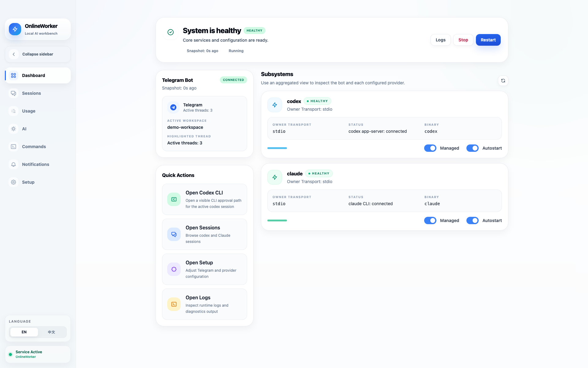
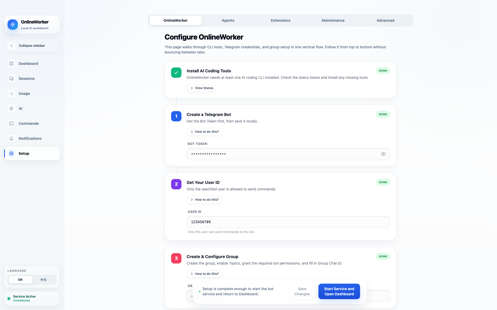

# OnlineWorker

<p align="center">
  
</p>

OnlineWorker is a macOS AI coding workspace for local CLI agents. The Mac app is the main control surface for setup, sessions, commands, logs, and service lifecycle. Telegram is a lightweight remote entry point for starting work, adding context, handling approvals, checking status, and receiving the final response.

The default workflow is **App / Sessions as the primary control surface + Telegram for the final reply**.

中文说明见 [README.zh.md](README.zh.md).

See also:

- [Documentation Notes](docs/README.md)
- [Contributing](CONTRIBUTING.md)
- [Security Policy](SECURITY.md)
- [Support](SUPPORT.md)

## Screenshots

<p align="center">
  
  
</p>

## Overview

- macOS desktop workspace for running and supervising local AI coding CLIs.
- Built around an installed app, not a browser-hosted service.
- App for setup and ongoing control, Telegram for remote input and final delivery.
- Builtin providers in this repository: `codex` and `claude`.
- A first-class `Usage` page for recent provider consumption, with `Codex / Claude` switching inside the app.

## Features

- Mac app control for setup, dashboard, sessions, commands, and logs.
- Telegram entry point for remote task submission and final updates.
- Provider-driven configuration for supported CLI backends.
- Session browsing and message sending from the app.
- A dedicated `Usage` page for recent provider usage, with a default 7-day window, date filtering, summary cards, and daily charts.
- Usage aggregation stays behind provider/plugin adapters instead of pushing provider-specific parsing into shared React surfaces.
- Markdown rendering for final replies.
- Installer-friendly macOS packaging through Tauri and PyInstaller.

## Provider Scope

This repository ships builtin support for:

- `codex`
- `claude`

The app also supports external provider packages through the public plugin
contracts, but this repository only bundles the builtin providers listed above.

## Requirements

- macOS
- Node.js 20
- Python 3.13
- Rust toolchain for the Tauri backend
- `codex` CLI for Codex-backed workflows
- `claude` CLI for Claude-backed workflows

## Quick Start

1. Build the DMG locally or download a packaged DMG.
2. Open the DMG and drag `OnlineWorker.app` into `/Applications`.
3. If macOS blocks the app on first launch, remove the quarantine attribute:

```bash
xattr -cr /Applications/OnlineWorker.app
```

4. Launch `OnlineWorker.app`.

## Initial Setup

1. Open the app and go to `Setup`.
2. Make sure the supported CLI tools you want to use are installed and visible in `PATH`.
3. Fill in the Telegram values:
   - `TELEGRAM_TOKEN`
   - `ALLOWED_USER_ID`
   - `GROUP_CHAT_ID`
4. If you use Claude through the official login flow, run `claude auth login` first.
5. Use the in-app connectivity checks on the `Setup` page to confirm Telegram access.
6. Go back to `Dashboard` and start the service.

## Configuration

The installed app reads and writes user data under:

```text
~/Library/Application Support/OnlineWorker/config.yaml
~/Library/Application Support/OnlineWorker/.env
```

When running from source, the repo root may also use local `config.yaml`, `.env`, and `onlineworker_state.json` files.

Additional provider packages can be mounted by setting `ONLINEWORKER_PROVIDER_OVERLAY` to a file or directory path. When the path points to a directory, OnlineWorker scans any `plugin.yaml` files under that tree and loads the provider descriptors it finds there. The installed app also reads the same key from `~/Library/Application Support/OnlineWorker/.env`, with process env taking priority when both are present.

### `.env`

```bash
TELEGRAM_TOKEN=your_bot_token_here
ALLOWED_USER_ID=123456789
GROUP_CHAT_ID=-1001234567890

# Optional Claude proxy / API configuration.
# Leave these empty for the standard CLI login flow.
ANTHROPIC_API_KEY=
ANTHROPIC_BASE_URL=
ANTHROPIC_MODEL=
```

### `config.yaml`

`config.yaml` is the app configuration file for provider and Telegram settings. Use the in-app settings UI to edit it in normal workflows.

## Development

### Run the bot from source

```bash
cd /path/to/onlineWorker
/path/to/python3 main.py
```

By default, source-mode runs now use the same stable app data directory as the packaged app.
Use `--data-dir /custom/path` only when you intentionally want an isolated runtime state.

### Run the Mac app in development mode

```bash
cd /path/to/onlineWorker/mac-app
pnpm dev
```

### Run tests

```bash
/path/to/python3 -m pytest -q tests/test_config.py tests/test_provider_facts.py tests/test_state.py tests/test_session_events.py

bash scripts/bootstrap-sidecar.sh
cargo test --manifest-path mac-app/src-tauri/Cargo.toml --quiet

cd mac-app
node --test tests/*.test.mjs
pnpm build
```

`pnpm build` may emit a pre-existing Vite chunk-size warning. As long as the command exits with status 0, the build is successful.

`scripts/bootstrap-sidecar.sh` creates an ignored local placeholder sidecar required by Tauri's build metadata checks. It is only for source-tree tests; `scripts/build.sh` replaces it with the real PyInstaller sidecar before packaging.

## Build

### Apple Silicon DMG

```bash
cd /path/to/onlineWorker
bash scripts/build.sh
```

This build path packages the base app from this repository. Additional provider packages can be mounted at runtime through `ONLINEWORKER_PROVIDER_OVERLAY`, or staged at build time through `ONLINEWORKER_PLUGIN_SOURCE_DIRS` before calling the same `scripts/build.sh`.

Pushing a version tag such as `1.0.0` also builds this same Apple Silicon DMG automatically through `.github/workflows/release-dmg.yml`. The workflow uploads the DMG as a workflow artifact, creates the matching GitHub Release if needed, and then attaches the DMG to that Release asset list.

### Intel DMG

```bash
cd /path/to/onlineWorker
arch -x86_64 /usr/local/bin/python3.13 -m PyInstaller onlineworker-x86_64.spec --clean --noconfirm --distpath dist-x86_64
cp dist-x86_64/onlineworker-bot mac-app/src-tauri/binaries/onlineworker-bot-x86_64-apple-darwin

cd mac-app
pnpm tauri build --target x86_64-apple-darwin
```

## Repository Layout

```text
onlineWorker/
├── main.py                  # Bot entry point
├── bot/                     # Telegram bot handlers and utilities
├── core/                    # Shared runtime, state, storage, and provider contracts
├── mac-app/                 # Tauri + React Mac app
├── plugins/                 # Provider descriptors and runtime implementations
├── scripts/                 # Build and maintenance scripts
├── tests/                   # Python tests
├── deploy/                  # Packaging and deployment notes
└── README.md
```

## Notes

- Source mode is for development and troubleshooting.
- App installation and verification should always be done against the packaged app.
- Local generated files such as `__pycache__`, `.pytest_cache`, build outputs, and `onlineworker_state.json` should remain untracked.

## License

MIT. See [LICENSE](LICENSE).
