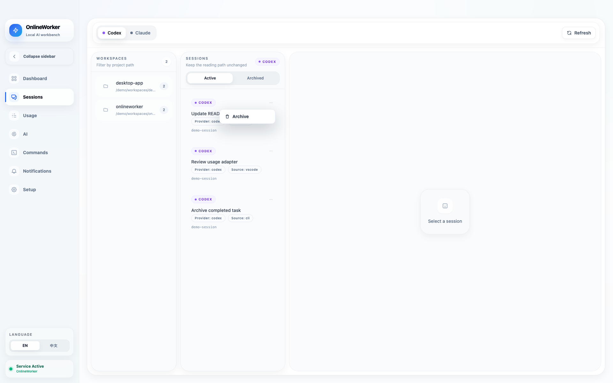
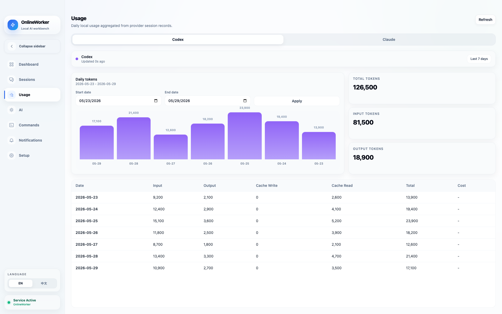
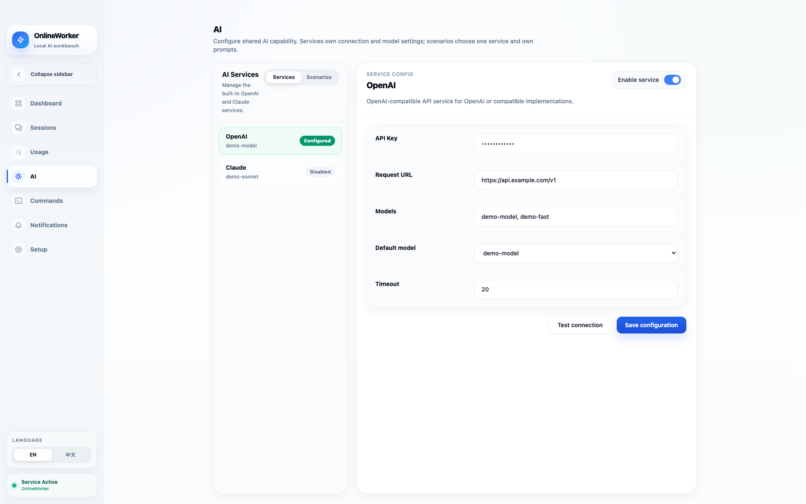
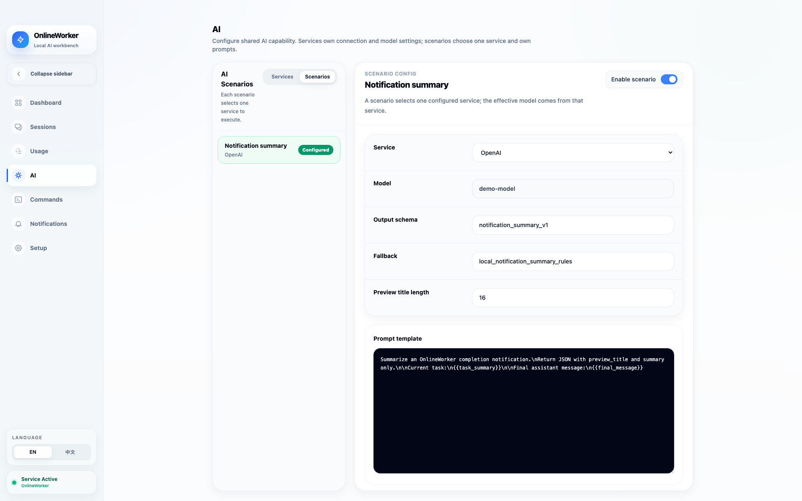

# OnlineWorker

<p align="center">
  
</p>

OnlineWorker is a macOS AI coding workspace for local CLI agents. The Mac app is the main control surface for setup, sessions, commands, logs, and service lifecycle. Telegram is a lightweight remote entry point for starting work, adding context, handling approvals, checking status, and receiving the final response.

The default workflow is **App / Sessions as the primary control surface + Telegram for the final reply**.

中文说明见 [README.zh.md](README.zh.md).

See also:

- [Documentation Notes](docs/README.md)
- [Contributing](CONTRIBUTING.md)
- [Security Policy](SECURITY.md)
- [Support](SUPPORT.md)

## Product Tour

These screenshots are generated from the real app UI with sanitized demo data.
They do not contain live tokens, user IDs, filesystem paths, session content, or
private extension configuration.

### Dashboard

<p align="center">
  
</p>

The Dashboard is the daily control surface. It shows service state, provider
health, recent activity, and the quickest path back into setup, sessions, logs,
commands, and usage.

### Sessions

<p align="center">
  
</p>

Sessions are the primary work surface. You can browse provider sessions, filter
active and archived rows, open a conversation, send text with image/file
attachments, and archive rows through provider-backed actions.

### Usage

<p align="center">
  
</p>

The Usage page reads consumption through provider metadata and usage hooks. It
supports provider switching, a default 7-day window, date filtering, summary
cards, and daily charts without hard-coding provider-specific parsing into the
React page.

### AI Services and Scenarios

<p align="center">
  
</p>

<p align="center">
  
</p>

The AI page separates reusable service credentials from scenario prompts.
OpenAI-compatible chat completions and Claude-compatible messages are available
as built-in service types. Notification completion summary is the first built-in
scenario and falls back to local deterministic summary rules when AI is disabled
or unavailable.

### Setup

<p align="center">
  
</p>

Setup handles the practical first-run checks: required CLI visibility, Telegram
connectivity, service lifecycle, and configuration needed before the app becomes
the main control surface.

## Core Capabilities

- macOS desktop workspace for running and supervising local AI coding CLIs.
- Installed app first; Telegram is a lightweight remote entry point for task
  submission, context, approvals, status, and final replies.
- Builtin providers in this repository: `codex` and `claude`; external provider
  packages can be mounted through the public plugin contracts.
- Builtin notification channel in this repository: `telegram`; external
  notification packages can be mounted through the notification plugin contract.
- Provider-driven configuration for supported CLI backends.
- Telegram mirrors provider approvals and questions. Codex approvals are handled
  only through the app-server request/response path; Telegram buttons reply to
  that server request.
- Plugin-based notification channels, configurable from the first-class
  `Notifications` page.
- Markdown rendering for final replies.
- Installer-friendly macOS packaging through Tauri and PyInstaller.

## Install and Setup

### Requirements

- macOS
- Node.js 20
- Python 3.13
- Rust toolchain for the Tauri backend
- `codex` CLI for Codex-backed workflows
- `claude` CLI for Claude-backed workflows

### Quick Start

1. Build the DMG locally or download a packaged DMG.
2. Open the DMG and drag `OnlineWorker.app` into `/Applications`.
3. If macOS blocks the app on first launch, remove the quarantine attribute:

```bash
xattr -cr /Applications/OnlineWorker.app
```

4. Launch `OnlineWorker.app`.

### Initial Setup

1. Open the app and go to `Setup`.
2. Make sure the supported CLI tools you want to use are installed and visible in `PATH`.
3. Fill in the Telegram values:
   - `TELEGRAM_TOKEN`
   - `ALLOWED_USER_ID`
   - `GROUP_CHAT_ID`
4. If you use Claude through the official login flow, run `claude auth login` first. If you use a custom upstream or launcher, fill the Claude provider card in `Setup` instead of hand-editing env files.
5. Use the in-app connectivity checks on the `Setup` page to confirm Telegram access.
6. Go back to `Dashboard` and start the service.

### Configuration

The installed app reads and writes user data under:

```text
~/Library/Application Support/OnlineWorker/config.yaml
~/Library/Application Support/OnlineWorker/.env
~/Library/Application Support/OnlineWorker/im_routes.sqlite3
```

When running from source, the repo root may also use local `config.yaml`, `.env`,
and `onlineworker_state.json` files. In normal workflows, edit configuration
through the app settings UI.

`.env` keeps Telegram bootstrap values:

```bash
TELEGRAM_TOKEN=your_bot_token_here
ALLOWED_USER_ID=123456789
GROUP_CHAT_ID=-1001234567890
```

Claude can be configured from the Claude provider card in `Setup`.

- `Claude Auth Token` maps to `ANTHROPIC_AUTH_TOKEN`
- `Claude Base URL` maps to `ANTHROPIC_BASE_URL`
- `Claude Model` maps to `ANTHROPIC_MODEL`

OnlineWorker stores these values in the Claude provider's `external_cli` block in
`config.yaml` and injects them into the Claude runtime only when the matching
environment variable is not already present in the current process. That keeps
shell-level overrides working while still making packaged runs self-contained.
The `Launcher wraps Claude` toggle is available for wrapper binaries that
ultimately invoke `claude`.

`config.yaml` stores provider, Telegram, notification channel, and AI
service/scenario settings. Provider overlays can be mounted with
`ONLINEWORKER_PROVIDER_OVERLAY`; notification overlays can be mounted with
`ONLINEWORKER_NOTIFICATION_OVERLAY`.

`im_routes.sqlite3` stores route bindings from external IM entries to fixed
OnlineWorker targets. Internal targets are only `agent`, `workspace`, and
`session`; Telegram topics, Slack threads, Feishu chats, or other IM entries are
external entries. `topic_id` values in `onlineworker_state.json` are
compatibility mirrors, while runtime routing is backed by `im_routes.sqlite3`.
Unknown IM entries are recorded as `unknown` and do not fall back to the active
workspace/session.

## Runtime Workflows

### Provider Interactions

OnlineWorker presents provider approvals and questions through a shared
App/Telegram flow. Codex approval prompts are accepted only when they arrive as
app-server server requests, and Telegram button clicks respond through
`reply_server_request(...)`.

### Session Operations

Sessions can be browsed, messaged, filtered by active/archived state, and
archived from the Sessions page. Archive is provider-backed: OnlineWorker calls
the provider's real archive path first, updates local state only after success,
and leaves the session unchanged if the provider reports failure.

The `New` entry under an active workspace opens a first-message composer instead
of creating a local placeholder session. Sending the first message asks the
provider to create a real session and then sends the message into that provider
thread. For Codex, slow `thread/start` calls may return a pending result to the
UI while OnlineWorker waits for the app-server notification that contains the
real thread id; once the activity stream reports the matching provider-backed
session, Sessions selects that real session and keeps the optimistic user
message visible. Local `app:*` draft ids are not shown as sessions.

### Usage

Usage data is exposed through provider metadata and usage hooks. The app shows
usage-capable providers dynamically on the Usage page, so new providers can
participate without hard-coded React parsing.

Telegram also supports `/token_usage` as a local command in agent topics. The
command is handled by OnlineWorker and is not forwarded into the active
conversation. Concrete session topics reject it with guidance because usage is
meaningful at the agent/provider topic level.

### AI Scenarios

The AI layer is a shared app capability, not a provider session. Notification
completion summary uses the `notification_summary` scenario when enabled and
correctly configured; otherwise OnlineWorker falls back to local summary rules.

## Development

### Run the bot from source

```bash
cd /path/to/onlineWorker
/path/to/python3 main.py
```

By default, source-mode runs now use the same stable app data directory as the packaged app.
Use `--data-dir /custom/path` only when you intentionally want an isolated runtime state.

### Run the Mac app in development mode

```bash
cd /path/to/onlineWorker/mac-app
pnpm dev
```

### Run tests

```bash
/path/to/python3 -m pytest -q tests/test_config.py tests/test_provider_facts.py tests/test_state.py tests/test_session_events.py

bash scripts/bootstrap-sidecar.sh
cargo test --manifest-path mac-app/src-tauri/Cargo.toml --quiet

cd mac-app
node --test tests/*.test.mjs
pnpm build
```

`pnpm build` may emit a pre-existing Vite chunk-size warning. As long as the command exits with status 0, the build is successful.

`scripts/bootstrap-sidecar.sh` creates an ignored local placeholder sidecar required by Tauri's build metadata checks. It is only for source-tree tests; `scripts/build.sh` replaces it with the real PyInstaller sidecar before packaging.

## Build

### Apple Silicon DMG

```bash
cd /path/to/onlineWorker
bash scripts/build.sh
```

This build path packages the base app from this repository. Additional provider packages can be mounted at runtime through `ONLINEWORKER_PROVIDER_OVERLAY`, notification packages can be mounted through `ONLINEWORKER_NOTIFICATION_OVERLAY`, and provider packages can be staged at build time through `ONLINEWORKER_PLUGIN_SOURCE_DIRS` before calling the same `scripts/build.sh`.

Pushing a version tag such as `1.2.1` also builds this same Apple Silicon DMG automatically through `.github/workflows/release-dmg.yml`. The workflow uploads the DMG as a workflow artifact, creates the matching GitHub Release if needed, and then attaches the DMG to that Release asset list.

After a local DMG is already built, this helper installs it into
`/Applications`, restarts the packaged app, and verifies that both app and bot
processes are running:

```bash
bash scripts/install-current-dmg.sh mac-app/src-tauri/target/release/bundle/dmg/OnlineWorker_1.2.1_aarch64.dmg
```

To restart the currently installed app without reinstalling a DMG:

```bash
bash scripts/restart-installed-app.sh
```

### Intel DMG

Intel packaging is documented in [deploy/BUILD.md](deploy/BUILD.md).

## Repository Layout

```text
onlineWorker/
├── main.py                  # Bot entry point
├── bot/                     # Telegram bot handlers and utilities
├── core/                    # Shared runtime, state, storage, and provider contracts
├── mac-app/                 # Tauri + React Mac app
├── plugins/                 # Provider and notification plugin descriptors/runtime implementations
├── scripts/                 # Build and maintenance scripts
├── tests/                   # Python tests
├── deploy/                  # Packaging and deployment notes
└── README.md
```

## Notes

- Source mode is for development and troubleshooting.
- App installation and verification should always be done against the packaged app.

## License

MIT. See [LICENSE](LICENSE).
